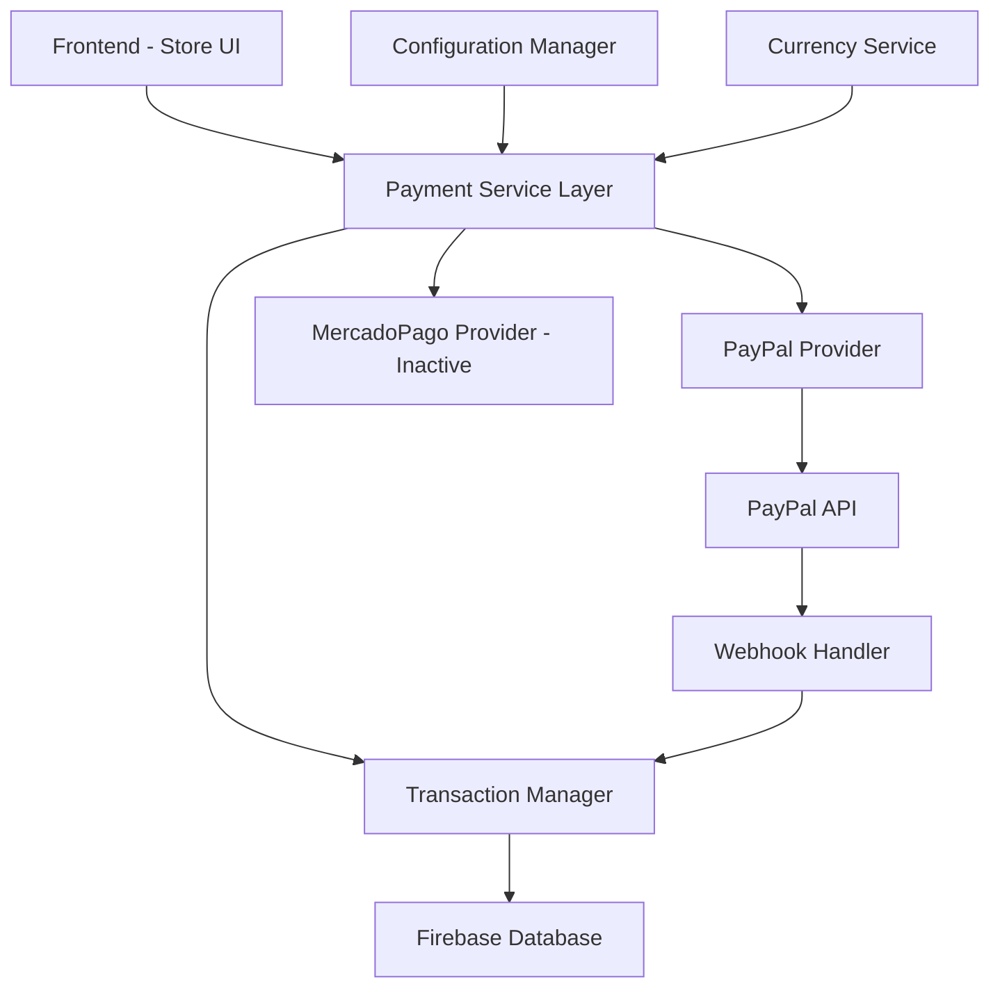
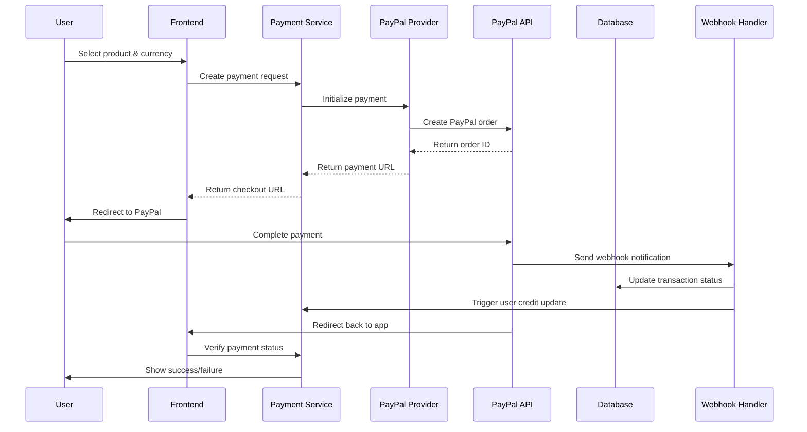

# Design Document - Integración de Pagos con PayPal

## Overview

Este documento describe el diseño técnico para la integración completa de PayPal como sistema de pagos principal en Quiz Cristiano. La solución implementará un sistema de pagos robusto que soporte múltiples monedas (ARS/USD), suscripciones recurrentes, y mantenga compatibilidad con el sistema existente de MercadoPago.

La arquitectura seguirá un patrón de abstracción que permita intercambiar proveedores de pago sin afectar la lógica de negocio, utilizando las APIs oficiales de PayPal para garantizar seguridad y confiabilidad.

## Architecture

### High-Level Architecture



### Payment Flow Architecture



## Components and Interfaces

### 1. Payment Service Layer

**Location:** `js/modules/payments/payment-service.js`

```javascript
class PaymentService {
  constructor(provider = "paypal") {
    this.provider = this.getProvider(provider);
    this.config = new ConfigurationManager();
    this.currency = new CurrencyService();
    this.transactionManager = new TransactionManager();
  }

  async createPayment(productId, userId, currency) {
    const product = this.config.getProduct(productId);
    const price = this.currency.getProductPrice(product, currency);

    const transaction = await this.transactionManager.createTransaction({
      userId,
      productId,
      price,
      currency,
      status: "pending",
    });

    return await this.provider.initializePayment({
      transactionId: transaction.id,
      amount: price,
      currency,
      productName: product.name,
      returnUrl: `${window.location.origin}/payment/success`,
      cancelUrl: `${window.location.origin}/payment/cancel`,
    });
  }

  async verifyPayment(paymentId) {
    return await this.provider.capturePayment(paymentId);
  }

  async createSubscription(planId, userId, currency) {
    const plan = this.config.getSubscriptionPlan(planId);
    return await this.provider.createSubscription({
      planId,
      userId,
      currency,
      amount: this.currency.getProductPrice(plan, currency),
    });
  }

  getProvider(providerName) {
    switch (providerName) {
      case "paypal":
        return new PayPalProvider(this.config.getProviderConfig("paypal"));
      case "mercadopago":
        return new MercadoPagoProvider(
          this.config.getProviderConfig("mercadopago")
        );
      default:
        throw new Error(`Provider ${providerName} not supported`);
    }
  }
}
```

### 2. PayPal Provider

**Location:** `js/modules/payments/providers/paypal-provider.js`

```javascript
class PayPalProvider {
  constructor(config) {
    this.clientId = config.clientId;
    this.environment = config.environment;
    this.currency = config.defaultCurrency;
    this.initializeSDK();
  }

  initializeSDK() {
    if (!window.paypal) {
      const script = document.createElement("script");
      script.src = `https://www.paypal.com/sdk/js?client-id=${this.clientId}&currency=${this.currency}&components=buttons`;
      document.head.appendChild(script);
    }
  }

  async initializePayment(orderData) {
    return new Promise((resolve, reject) => {
      window.paypal
        .Buttons({
          createOrder: (data, actions) => {
            return actions.order.create({
              purchase_units: [
                {
                  amount: {
                    value: orderData.amount,
                    currency_code: orderData.currency,
                  },
                  description: orderData.productName,
                  custom_id: orderData.transactionId,
                },
              ],
            });
          },
          onApprove: async (data, actions) => {
            try {
              const order = await actions.order.capture();
              resolve({
                success: true,
                orderId: data.orderID,
                paymentId: order.id,
                transactionId: orderData.transactionId,
              });
            } catch (error) {
              reject(error);
            }
          },
          onError: (err) => {
            reject(err);
          },
          onCancel: (data) => {
            resolve({
              success: false,
              cancelled: true,
              orderId: data.orderID,
            });
          },
        })
        .render("#paypal-button-container");
    });
  }

  async capturePayment(orderId) {
    const response = await fetch(`/api/paypal/capture/${orderId}`, {
      method: "POST",
      headers: {
        "Content-Type": "application/json",
      },
    });
    return await response.json();
  }

  async createSubscription(subscriptionData) {
    const response = await fetch("/api/paypal/subscription", {
      method: "POST",
      headers: {
        "Content-Type": "application/json",
      },
      body: JSON.stringify(subscriptionData),
    });
    return await response.json();
  }

  async cancelSubscription(subscriptionId) {
    const response = await fetch(
      `/api/paypal/subscription/${subscriptionId}/cancel`,
      {
        method: "POST",
      }
    );
    return await response.json();
  }
}
```

### 3. Configuration Manager

**Location:** `js/config/payment-config.js`

```javascript
class ConfigurationManager {
  constructor() {
    this.config = {
      providers: {
        paypal: {
          clientId: this.getEnvVar("PAYPAL_CLIENT_ID"),
          environment:
            this.getEnvVar("NODE_ENV") === "production"
              ? "production"
              : "sandbox",
          supportedCurrencies: ["USD", "ARS"],
          webhookId: this.getEnvVar("PAYPAL_WEBHOOK_ID"),
        },
        mercadopago: {
          active: false,
          publicKey: this.getEnvVar("MP_PUBLIC_KEY"),
          accessToken: this.getEnvVar("MP_ACCESS_TOKEN"),
        },
      },
      products: {
        coins: [
          {
            id: "coins_100",
            name: "100 Monedas",
            amount: 100,
            priceUSD: 0.99,
            priceARS: 150,
          },
          {
            id: "coins_500",
            name: "500 Monedas",
            amount: 500,
            priceUSD: 4.99,
            priceARS: 750,
          },
          {
            id: "coins_1000",
            name: "1000 Monedas",
            amount: 1000,
            priceUSD: 9.99,
            priceARS: 1500,
          },
          {
            id: "coins_5000",
            name: "5000 Monedas",
            amount: 5000,
            priceUSD: 39.99,
            priceARS: 6000,
          },
        ],
        subscriptions: [
          {
            id: "premium_monthly",
            name: "Premium Mensual",
            priceUSD: 4.99,
            priceARS: 750,
            interval: "month",
          },
        ],
      },
    };
  }

  getEnvVar(name) {
    return process.env[name] || "";
  }

  getProviderConfig(provider) {
    return this.config.providers[provider];
  }

  getProduct(productId) {
    return this.config.products.coins.find((p) => p.id === productId);
  }

  getSubscriptionPlan(planId) {
    return this.config.products.subscriptions.find((p) => p.id === planId);
  }

  getAllProducts() {
    return this.config.products;
  }
}
```

### 4. Currency Service

**Location:** `js/modules/payments/currency-service.js`

```javascript
class CurrencyService {
  constructor() {
    this.defaultCurrency = this.detectUserCurrency();
    this.supportedCurrencies = ["USD", "ARS"];
    this.exchangeRates = {
      USD_TO_ARS: 150, // Tasa de ejemplo, debería actualizarse dinámicamente
      ARS_TO_USD: 0.0067,
    };
  }

  detectUserCurrency() {
    try {
      const userCountry = this.getUserCountry();
      return userCountry === "AR" ? "ARS" : "USD";
    } catch (error) {
      return "USD"; // Fallback por defecto
    }
  }

  getUserCountry() {
    // Detectar país usando geolocalización o IP
    const timezone = Intl.DateTimeFormat().resolvedOptions().timeZone;
    if (timezone.includes("Argentina") || timezone.includes("Buenos_Aires")) {
      return "AR";
    }
    return "US"; // Fallback
  }

  formatPrice(amount, currency) {
    const locale = currency === "ARS" ? "es-AR" : "en-US";
    return new Intl.NumberFormat(locale, {
      style: "currency",
      currency: currency,
    }).format(amount);
  }

  getProductPrice(product, currency) {
    if (currency === "ARS") {
      return (
        product.priceARS || this.convertCurrency(product.priceUSD, "USD", "ARS")
      );
    }
    return (
      product.priceUSD || this.convertCurrency(product.priceARS, "ARS", "USD")
    );
  }

  convertCurrency(amount, fromCurrency, toCurrency) {
    if (fromCurrency === toCurrency) return amount;

    const rateKey = `${fromCurrency}_TO_${toCurrency}`;
    const rate = this.exchangeRates[rateKey];

    if (!rate) {
      throw new Error(
        `Exchange rate not found for ${fromCurrency} to ${toCurrency}`
      );
    }

    return Math.round(amount * rate * 100) / 100;
  }

  getCurrencySymbol(currency) {
    const symbols = {
      USD: "$",
      ARS: "$",
    };
    return symbols[currency] || currency;
  }
}
```

### 5. Transaction Manager

**Location:** `js/modules/payments/transaction-manager.js`

```javascript
class TransactionManager {
  constructor() {
    this.db = firebase.firestore();
  }

  async createTransaction(transactionData) {
    const transaction = {
      id: this.generateTransactionId(),
      userId: transactionData.userId,
      productId: transactionData.productId,
      productType: transactionData.productType || "coins",
      amount: transactionData.amount || 0,
      price: transactionData.price,
      currency: transactionData.currency,
      status: "pending",
      createdAt: firebase.firestore.FieldValue.serverTimestamp(),
      metadata: {
        userAgent: navigator.userAgent,
        deviceType: this.getDeviceType(),
      },
    };

    await this.db
      .collection("transactions")
      .doc(transaction.id)
      .set(transaction);
    return transaction;
  }

  async updateTransactionStatus(transactionId, status, paypalData = {}) {
    const updateData = {
      status,
      paypalData,
      updatedAt: firebase.firestore.FieldValue.serverTimestamp(),
    };

    if (status === "completed") {
      updateData.completedAt = firebase.firestore.FieldValue.serverTimestamp();
    }

    await this.db
      .collection("transactions")
      .doc(transactionId)
      .update(updateData);
  }

  async creditUserAccount(userId, amount, transactionId) {
    const userRef = this.db.collection("users").doc(userId);

    await this.db.runTransaction(async (transaction) => {
      const userDoc = await transaction.get(userRef);
      const currentCoins = userDoc.data().coins || 0;

      transaction.update(userRef, {
        coins: currentCoins + amount,
        lastPurchase: firebase.firestore.FieldValue.serverTimestamp(),
      });

      // Registrar el crédito en el historial
      transaction.set(this.db.collection("userCredits").doc(), {
        userId,
        amount,
        transactionId,
        creditedAt: firebase.firestore.FieldValue.serverTimestamp(),
      });
    });
  }

  async getTransactionHistory(userId) {
    const snapshot = await this.db
      .collection("transactions")
      .where("userId", "==", userId)
      .orderBy("createdAt", "desc")
      .limit(50)
      .get();

    return snapshot.docs.map((doc) => ({
      id: doc.id,
      ...doc.data(),
    }));
  }

  generateTransactionId() {
    return "txn_" + Date.now() + "_" + Math.random().toString(36).substr(2, 9);
  }

  getDeviceType() {
    const userAgent = navigator.userAgent;
    if (/tablet|ipad|playbook|silk/i.test(userAgent)) {
      return "tablet";
    }
    if (
      /mobile|iphone|ipod|android|blackberry|opera|mini|windows\sce|palm|smartphone|iemobile/i.test(
        userAgent
      )
    ) {
      return "mobile";
    }
    return "desktop";
  }
}
```

## Data Models

### Transaction Model

```javascript
const TransactionSchema = {
  id: String, // UUID generado localmente
  userId: String,
  paypalOrderId: String,
  paypalPaymentId: String,
  productId: String,
  productType: String, // 'coins' | 'subscription'
  amount: Number, // Cantidad de monedas o beneficio
  price: Number,
  currency: String, // 'USD' | 'ARS'
  status: String, // 'pending' | 'completed' | 'failed' | 'cancelled'
  createdAt: Timestamp,
  completedAt: Timestamp,
  updatedAt: Timestamp,
  paypalData: Object, // Datos completos de respuesta de PayPal
  metadata: {
    userAgent: String,
    deviceType: String,
    ipAddress: String,
  },
};
```

### Subscription Model

```javascript
const SubscriptionSchema = {
  id: String,
  userId: String,
  paypalSubscriptionId: String,
  planId: String,
  status: String, // 'active' | 'cancelled' | 'expired' | 'suspended'
  currentPeriodStart: Timestamp,
  currentPeriodEnd: Timestamp,
  nextBillingDate: Timestamp,
  currency: String,
  amount: Number,
  createdAt: Timestamp,
  cancelledAt: Timestamp,
  paypalData: Object,
};
```

### User Payment Profile

```javascript
const UserPaymentProfileSchema = {
  userId: String,
  preferredCurrency: String,
  paymentHistory: Array, // Referencias a transacciones
  activeSubscriptions: Array, // Referencias a suscripciones activas
  totalSpent: {
    USD: Number,
    ARS: Number,
  },
  lastPaymentDate: Timestamp,
  paymentMethods: Array, // Métodos de pago guardados (si aplica)
};
```

## Error Handling

### Error Categories

1. **Payment Processing Errors**

   - PayPal API errors
   - Network connectivity issues
   - Invalid payment data
   - Insufficient funds

2. **Webhook Processing Errors**

   - Invalid webhook signatures
   - Duplicate webhook events
   - Database update failures
   - User account update failures

3. **Configuration Errors**
   - Missing API credentials
   - Invalid product configurations
   - Currency conversion errors

### Error Handling Strategy

```javascript
class PaymentErrorHandler {
  static handlePayPalError(error) {
    const errorMap = {
      INSTRUMENT_DECLINED: "Tu método de pago fue rechazado. Intenta con otro.",
      INSUFFICIENT_FUNDS: "Fondos insuficientes en tu cuenta.",
      INVALID_REQUEST: "Error en los datos de pago. Intenta nuevamente.",
      INTERNAL_SERVER_ERROR: "Error interno del servidor. Intenta más tarde.",
      PAYER_ACTION_REQUIRED: "Se requiere acción adicional del pagador.",
      UNPROCESSABLE_ENTITY: "Los datos de pago no son válidos.",
    };

    return {
      userMessage: errorMap[error.name] || "Error desconocido en el pago.",
      technicalError: error,
      shouldRetry: ["INTERNAL_SERVER_ERROR", "NETWORK_ERROR"].includes(
        error.name
      ),
    };
  }

  static async logError(error, context) {
    const errorLog = {
      timestamp: new Date().toISOString(),
      error: error.message,
      stack: error.stack,
      context,
      userId: context.userId || "anonymous",
    };

    // Enviar a servicio de logging
    await fetch("/api/errors", {
      method: "POST",
      headers: { "Content-Type": "application/json" },
      body: JSON.stringify(errorLog),
    });
  }
}
```

## Testing Strategy

### Unit Testing

1. **Payment Service Tests**

   - Test payment creation flow
   - Test currency conversion
   - Test error handling scenarios

2. **Provider Tests**

   - Mock PayPal API responses
   - Test webhook processing
   - Test subscription management

3. **Configuration Tests**
   - Test environment variable loading
   - Test product configuration validation

### Integration Testing

1. **PayPal Sandbox Testing**

   - Test complete payment flows
   - Test webhook delivery
   - Test subscription lifecycle

2. **Database Integration**
   - Test transaction persistence
   - Test user account updates
   - Test data consistency

### End-to-End Testing

1. **User Journey Tests**

   - Complete purchase flow
   - Subscription management
   - Payment history viewing

2. **Mobile Testing**
   - Responsive design validation
   - Mobile payment flows
   - App integration testing

## Security Considerations

### Data Protection

1. **PCI Compliance**

   - No storage of sensitive payment data
   - Use PayPal hosted checkout
   - Secure transmission of all data

2. **Authentication**

   - Webhook signature verification
   - API key protection
   - User session validation

3. **Data Encryption**
   - HTTPS for all communications
   - Encrypted storage of transaction data
   - Secure environment variables

### Fraud Prevention

1. **Transaction Monitoring**

   - Unusual spending pattern detection
   - Multiple failed payment attempts
   - Geographic anomaly detection

2. **Rate Limiting**
   - Limit payment attempts per user
   - Prevent automated attacks
   - Implement CAPTCHA for suspicious activity

## Performance Optimization

### Frontend Optimization

1. **Lazy Loading**

   - Load PayPal SDK only when needed
   - Defer non-critical payment UI components

2. **Caching Strategy**
   - Cache product configurations
   - Cache currency exchange rates
   - Cache user payment preferences

### Backend Optimization

1. **Database Optimization**

   - Index frequently queried fields
   - Implement connection pooling
   - Use batch operations for bulk updates

2. **API Optimization**
   - Implement request caching
   - Use compression for API responses
   - Optimize webhook processing

## Deployment Strategy

### Environment Configuration

1. **Development Environment**

   - PayPal Sandbox integration
   - Test database configuration
   - Debug logging enabled

2. **Production Environment**
   - PayPal Live API integration
   - Production database
   - Error monitoring and alerting

### Rollout Plan

1. **Phase 1: Core Payment Integration**

   - Basic PayPal payment processing
   - Single currency support (USD)
   - Basic error handling

2. **Phase 2: Multi-Currency Support**

   - Add ARS currency support
   - Implement currency detection
   - Enhanced user experience

3. **Phase 3: Subscription Management**

   - Recurring payment support
   - Subscription lifecycle management
   - Advanced reporting

4. **Phase 4: Advanced Features**
   - Payment history and analytics
   - Promotional pricing
   - Enhanced security featuresa la integración completa de PayPal como sistema de pagos principal en Quiz Cristiano. La solución implementará un sistema de pagos robusto que soporte múltiples monedas (ARS/USD), suscripciones recurrentes, y mantenga compatibilidad con el sistema existente de MercadoPago.

La arquitectura seguirá un patrón de abstracción que permita intercambiar proveedores de pago sin afectar la lógica de negocio, utilizando las APIs oficiales de PayPal para garantizar seguridad y confiabilidad.

## Architecture

### High-Level Architecture


### Payment Flow Architecture


## Components and Interfaces

### 1. Payment Service Layer

**Location:** `js/modules/payments/`

**Core Interface:**

```javascript
class PaymentService {
  constructor(provider = "paypal") {
    this.provider = this.getProvider(provider);
    this.config = new ConfigurationManager();
    this.currency = new CurrencyService();
  }

  async createPayment(productId, userId, currency) {
    // Abstract payment creation
  }

  async verifyPayment(paymentId) {
    // Abstract payment verification
  }

  async createSubscription(planId, userId, currency) {
    // Abstract subscription creation
  }
}
```

### 2. PayPal Provider

**Location:** `js/modules/payments/providers/paypal-provider.js`

```javascript
class PayPalProvider {
  constructor(config) {
    this.clientId = config.paypal.clientId;
    this.environment = config.paypal.environment; // 'sandbox' or 'production'
    this.currency = config.paypal.defaultCurrency;
  }

  async initializePayment(orderData) {
    // PayPal SDK integration
  }

  async capturePayment(orderId) {
    // Capture approved payment
  }

  async createSubscription(subscriptionData) {
    // Create recurring subscription
  }

  async cancelSubscription(subscriptionId) {
    // Cancel active subscription
  }
}
```

### 3. Configuration Manager

**Location:** `js/config/payment-config.js`

```javascript
const PaymentConfig = {
  providers: {
    paypal: {
      clientId: process.env.PAYPAL_CLIENT_ID,
      environment:
        process.env.NODE_ENV === "production" ? "production" : "sandbox",
      supportedCurrencies: ["USD", "ARS"],
      webhookId: process.env.PAYPAL_WEBHOOK_ID,
    },
    mercadopago: {
      // Mantener configuración existente para compatibilidad
      active: false,
    },
  },
  products: {
    coins: [
      { id: "coins_100", amount: 100, priceUSD: 0.99, priceARS: 150 },
      { id: "coins_500", amount: 500, priceUSD: 4.99, priceARS: 750 },
      { id: "coins_1000", amount: 1000, priceUSD: 9.99, priceARS: 1500 },
      { id: "coins_5000", amount: 5000, priceUSD: 39.99, priceARS: 6000 },
    ],
    subscriptions: [
      {
        id: "premium_monthly",
        priceUSD: 4.99,
        priceARS: 750,
        interval: "month",
      },
    ],
  },
};
```

### 4. Currency Service

**Location:** `js/modules/payments/currency-service.js`

```javascript
class CurrencyService {
  constructor() {
    this.defaultCurrency = this.detectUserCurrency();
    this.supportedCurrencies = ["USD", "ARS"];
  }

  detectUserCurrency() {
    // Detectar moneda basada en geolocalización
    const userCountry = this.getUserCountry();
    return userCountry === "AR" ? "ARS" : "USD";
  }

  formatPrice(amount, currency) {
    return new Intl.NumberFormat("es-AR", {
      style: "currency",
      currency: currency,
    }).format(amount);
  }

  getProductPrice(product, currency) {
    return currency === "ARS" ? product.priceARS : product.priceUSD;
  }
}
```

### 5. Transaction Manager

**Location:** `js/modules/payments/transaction-manager.js`

```javascript
class TransactionManager {
  constructor(database) {
    this.db = database;
  }

  async createTransaction(transactionData) {
    // Crear registro de transacción en Firebase
  }

  async updateTransactionStatus(transactionId, status, paypalData) {
    // Actualizar estado de transacción
  }

  async creditUserAccount(userId, amount, transactionId) {
    // Agregar monedas/beneficios a cuenta de usuario
  }

  async getTransactionHistory(userId) {
    // Obtener historial de transacciones del usuario
  }
}
```

### 6. Webhook Handler

**Location:** `api/paypal/webhook.js`

```javascript
// Vercel serverless function para manejar webhooks de PayPal
export default async function handler(req, res) {
  if (req.method !== "POST") {
    return res.status(405).json({ error: "Method not allowed" });
  }

  try {
    // Verificar autenticidad del webhook
    const isValid = await verifyPayPalWebhook(req.headers, req.body);

    if (!isValid) {
      return res.status(401).json({ error: "Invalid webhook" });
    }

    // Procesar evento de PayPal
    await processPayPalEvent(req.body);

    res.status(200).json({ success: true });
  } catch (error) {
    console.error("Webhook error:", error);
    res.status(500).json({ error: "Internal server error" });
  }
}
```

## Data Models

### Transaction Model

```javascript
const TransactionSchema = {
  id: String, // UUID generado localmente
  userId: String,
  paypalOrderId: String,
  paypalPaymentId: String,
  productId: String,
  productType: String, // 'coins' | 'subscription'
  amount: Number, // Cantidad de monedas o beneficio
  price: Number,
  currency: String, // 'USD' | 'ARS'
  status: String, // 'pending' | 'completed' | 'failed' | 'cancelled'
  createdAt: Timestamp,
  completedAt: Timestamp,
  paypalData: Object, // Datos completos de respuesta de PayPal
  metadata: {
    userAgent: String,
    ipAddress: String,
    deviceType: String,
  },
};
```

### Subscription Model

```javascript
const SubscriptionSchema = {
  id: String,
  userId: String,
  paypalSubscriptionId: String,
  planId: String,
  status: String, // 'active' | 'cancelled' | 'expired' | 'suspended'
  currentPeriodStart: Timestamp,
  currentPeriodEnd: Timestamp,
  nextBillingDate: Timestamp,
  currency: String,
  amount: Number,
  createdAt: Timestamp,
  cancelledAt: Timestamp,
  paypalData: Object,
};
```

### User Payment Profile

```javascript
const UserPaymentProfileSchema = {
  userId: String,
  preferredCurrency: String,
  paymentHistory: Array, // Referencias a transacciones
  activeSubscriptions: Array, // Referencias a suscripciones activas
  totalSpent: {
    USD: Number,
    ARS: Number,
  },
  lastPaymentDate: Timestamp,
  paymentMethods: Array, // Métodos de pago guardados (si aplica)
};
```

## Error Handling

### Error Categories

1. **Payment Processing Errors**

   - PayPal API errors
   - Network connectivity issues
   - Invalid payment data
   - Insufficient funds

2. **Webhook Processing Errors**

   - Invalid webhook signatures
   - Duplicate webhook events
   - Database update failures
   - User account update failures

3. **Configuration Errors**
   - Missing API credentials
   - Invalid product configurations
   - Currency conversion errors

### Error Handling Strategy

```javascript
class PaymentErrorHandler {
    static handlePayPalError(error) {
        const errorMap = {
            'INSTRUMENT_DECLINED': 'Tu método de pago fue rechazado. Intenta con otro.',
            'INSUFFICIENT_FUNDS': 'Fondos insuficientes en tu cuenta.',
            'INVALID_REQUEST': 'Error en los datos de pago. Intenta nuevamente.',
            'INTERNAL_SERVER_ERROR': '
```
