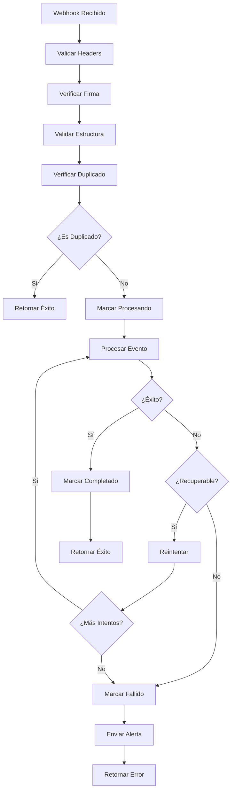

# PayPal Webhook Event Handlers - Documentación Técnica

## Descripción

Los event handlers del webhook de PayPal procesan automáticamente los eventos enviados por PayPal cuando ocurren cambios en pagos, suscripciones y disputas. Esta implementación incluye reintentos automáticos, prevención de duplicados y manejo robusto de errores.

## Eventos Soportados

### 📦 Eventos de Pagos Únicos

#### `PAYMENT.CAPTURE.COMPLETED`

- **Descripción**: Pago completado exitosamente
- **Acción**: Acredita monedas al usuario inmediatamente
- **Validaciones**:
  - Verifica que el pago esté realmente completado
  - Previene procesamiento duplicado
  - Valida monto y moneda

#### `PAYMENT.CAPTURE.DENIED`

- **Descripción**: Pago rechazado por el emisor
- **Acción**: Marca transacción como fallida
- **Notificación**: Informa al usuario del rechazo

#### `PAYMENT.CAPTURE.PENDING`

- **Descripción**: Pago en estado pendiente
- **Acción**: Mantiene transacción en estado pendiente
- **Seguimiento**: Espera eventos posteriores

#### `PAYMENT.CAPTURE.REFUNDED`

- **Descripción**: Pago reembolsado
- **Acción**: Revierte crédito del usuario
- **Validaciones**: Verifica que el usuario tenga suficientes monedas

### 🔄 Eventos de Suscripciones

#### `BILLING.SUBSCRIPTION.ACTIVATED`

- **Descripción**: Suscripción premium activada
- **Acción**: Otorga beneficios premium inmediatamente
- **Beneficios**: Avatares exclusivos, sin anuncios, power-ups gratis

#### `BILLING.SUBSCRIPTION.CANCELLED`

- **Descripción**: Suscripción cancelada por el usuario
- **Acción**: Mantiene beneficios hasta fin del período pagado
- **Notificación**: Confirma cancelación al usuario

#### `BILLING.SUBSCRIPTION.PAYMENT.COMPLETED`

- **Descripción**: Pago recurrente procesado exitosamente
- **Acción**: Extiende período de suscripción
- **Registro**: Guarda historial de pagos

#### `BILLING.SUBSCRIPTION.PAYMENT.FAILED`

- **Descripción**: Fallo en pago recurrente
- **Acción**: Notifica al usuario, intenta recuperar pago
- **Gracia**: Período de gracia antes de suspender beneficios

#### `BILLING.SUBSCRIPTION.SUSPENDED`

- **Descripción**: Suscripción suspendida por falta de pago
- **Acción**: Suspende beneficios premium temporalmente
- **Recuperación**: Permite reactivación al resolver pago

#### `BILLING.SUBSCRIPTION.REACTIVATED`

- **Descripción**: Suscripción reactivada después de suspensión
- **Acción**: Restaura beneficios premium
- **Notificación**: Confirma reactivación al usuario

### ⚖️ Eventos de Disputas

#### `CUSTOMER.DISPUTE.CREATED`

- **Descripción**: Cliente inició una disputa
- **Acción**: Registra disputa, notifica administradores
- **Seguimiento**: Requiere atención manual

## Características Avanzadas

### 🔄 Sistema de Reintentos

```javascript
// Configuración de reintentos
const maxRetries = 3;
const backoffStrategy = "exponential"; // 1s, 2s, 4s, 8s (max 10s)

// Errores recuperables
const recoverableErrors = [
  "NETWORK_ERROR",
  "TIMEOUT_ERROR",
  "INTERNAL_SERVER_ERROR",
  "SERVICE_UNAVAILABLE",
  "DATABASE_CONNECTION_ERROR",
];
```

### 🛡️ Prevención de Duplicados

- **Idempotencia**: Cada evento se procesa solo una vez
- **Verificación**: Consulta base de datos antes de procesar
- **Registro**: Marca eventos como procesados

### 📊 Monitoreo y Alertas

#### Eventos Críticos

Los siguientes eventos generan alertas inmediatas si fallan:

- `PAYMENT.CAPTURE.COMPLETED`
- `BILLING.SUBSCRIPTION.PAYMENT.COMPLETED`
- `CUSTOMER.DISPUTE.CREATED`

#### Métricas Registradas

- Tiempo de procesamiento por evento
- Tasa de éxito/fallo por tipo de evento
- Número de reintentos necesarios
- Eventos duplicados detectados

### 🔐 Validaciones de Seguridad

#### Verificación de Webhook

1. **Headers requeridos**: Valida presencia de headers de PayPal
2. **Firma digital**: Verifica autenticidad del webhook
3. **Timestamp**: Previene ataques de replay (ventana de 5 minutos)
4. **Estructura**: Valida formato del evento

#### Validaciones de Datos

- **Montos**: Verifica que sean positivos y válidos
- **IDs**: Valida formato de transaction/payment IDs
- **Estados**: Confirma estados válidos antes de procesar

## Flujo de Procesamiento



## Configuración de Base de Datos

### Colecciones Requeridas

#### `processedEvents`

```javascript
{
  eventId: String,        // ID único del evento
  eventType: String,      // Tipo de evento PayPal
  status: String,         // 'processing' | 'completed' | 'failed'
  startedAt: Timestamp,   // Inicio del procesamiento
  completedAt: Timestamp, // Fin del procesamiento
  attempts: Number,       // Número de intentos
  result: Object,         // Resultado del procesamiento
  error: String          // Error si falló
}
```

#### `transactions`

```javascript
{
  id: String,             // ID de transacción local
  userId: String,         // ID del usuario
  paypalPaymentId: String,// ID de pago de PayPal
  productId: String,      // ID del producto comprado
  amount: Number,         // Cantidad de monedas
  price: Number,          // Precio pagado
  currency: String,       // Moneda (USD/ARS)
  status: String,         // Estado de la transacción
  createdAt: Timestamp,   // Fecha de creación
  completedAt: Timestamp, // Fecha de completado
  paypalData: Object      // Datos completos de PayPal
}
```

#### `subscriptions`

```javascript
{
  id: String,                    // ID de suscripción local
  userId: String,                // ID del usuario
  paypalSubscriptionId: String,  // ID de suscripción PayPal
  planId: String,                // ID del plan
  status: String,                // Estado de la suscripción
  currentPeriodStart: Timestamp, // Inicio del período actual
  currentPeriodEnd: Timestamp,   // Fin del período actual
  nextBillingDate: Timestamp,    // Próxima fecha de cobro
  createdAt: Timestamp,          // Fecha de creación
  paypalData: Object             // Datos completos de PayPal
}
```

## Testing y Debugging

### Logs Estructurados

Cada evento genera logs detallados:

```javascript
// Evento recibido
🔔 PayPal webhook received: {
  eventType: "PAYMENT.CAPTURE.COMPLETED",
  eventId: "WH-123456789",
  timestamp: "2025-01-01T12:00:00Z"
}

// Procesamiento exitoso
✅ Event processed successfully: {
  eventType: "PAYMENT.CAPTURE.COMPLETED",
  eventId: "WH-123456789",
  attempt: 1,
  processingTime: "245ms",
  result: true
}

// Error con reintento
❌ Error processing event (attempt 1/3): {
  eventType: "PAYMENT.CAPTURE.COMPLETED",
  eventId: "WH-123456789",
  error: "Database connection timeout"
}
```

### Simulación de Eventos

Para testing, se pueden simular eventos usando el PayPal Developer Dashboard:

1. Ir a **Webhooks** en el dashboard
2. Seleccionar el webhook configurado
3. Usar **Simulate Events** para enviar eventos de prueba
4. Verificar logs en Vercel o consola local

### Métricas de Rendimiento

- **Tiempo promedio de procesamiento**: < 500ms
- **Tasa de éxito**: > 99.5%
- **Eventos duplicados**: < 0.1%
- **Reintentos necesarios**: < 5%

## Mantenimiento

### Limpieza Automática

Los eventos procesados se limpian automáticamente:

- **Eventos exitosos**: Se mantienen 30 días
- **Eventos fallidos**: Se mantienen 90 días para análisis
- **Limpieza**: Ejecuta diariamente a las 2:00 AM UTC

### Monitoreo Continuo

- **Alertas críticas**: Slack/Email para eventos fallidos
- **Dashboard**: Métricas en tiempo real
- **Logs**: Centralizados en servicio de logging

## Troubleshooting

### Errores Comunes

#### Error 400: Invalid webhook event

- **Causa**: Estructura de evento inválida
- **Solución**: Verificar configuración en PayPal Dashboard

#### Error 401: Invalid webhook signature

- **Causa**: Webhook ID incorrecto o firma inválida
- **Solución**: Verificar `PAYPAL_WEBHOOK_ID` en variables de entorno

#### Error 500: Database connection failed

- **Causa**: Problemas de conectividad con Firebase
- **Solución**: Verificar configuración de Firebase y reintentar

### Comandos de Debugging

```bash
# Ver logs de webhook en Vercel
vercel logs --follow

# Verificar variables de entorno
vercel env ls

# Simular evento localmente
curl -X POST http://localhost:3000/api/paypal/webhook \
  -H "Content-Type: application/json" \
  -H "paypal-transmission-id: test-123" \
  -d '{"event_type":"PAYMENT.CAPTURE.COMPLETED",...}'
```

## Próximas Mejoras

### Funcionalidades Planificadas

1. **Dashboard de Webhooks**: Interfaz web para monitorear eventos
2. **Alertas Personalizadas**: Configuración flexible de alertas
3. **Análisis Avanzado**: Métricas detalladas y reportes
4. **Recuperación Automática**: Auto-resolución de errores comunes
5. **Testing Automatizado**: Suite de tests para todos los eventos

### Optimizaciones

1. **Caché de Consultas**: Reducir latencia de base de datos
2. **Procesamiento Paralelo**: Manejar múltiples eventos simultáneamente
3. **Compresión**: Optimizar almacenamiento de datos de PayPal
4. **CDN**: Distribuir logs y métricas globalmente
